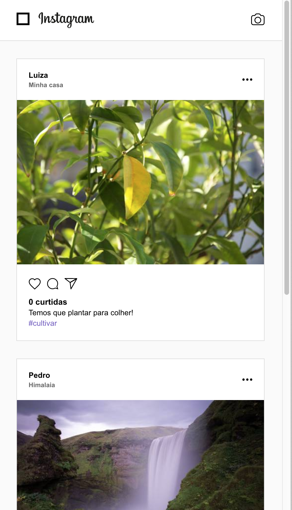

# instawebclone
App made with React for practice.

Main libs used: axios, react router and socket.io.

The application connects to a backend (https://github.com/juanvl/instanode) that saves all data in MongoDB Atlas.

Also there is a mobile version of this project: https://github.com/juanvl/instaclone

Screenshots:

  
  
  
  
  

